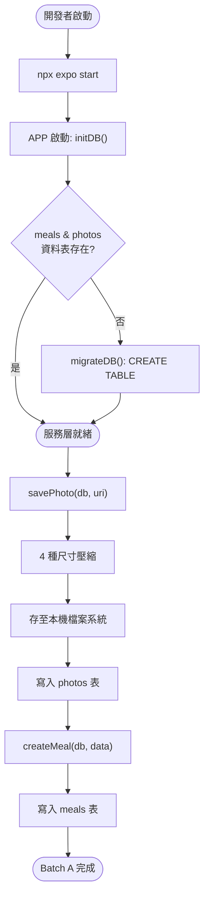

# SPARKPLATE — Batch A: 基礎設施

**Status**: In Progress  
**Date**: 2026-05-26  
**Scope**: Stages 1–6（Expo 初始化、型別、DB / Photo / Meal 服務層）

---

## Business Context

SPARK PLATE 是一個以照片紀錄每日三餐的行動 APP。  
Batch A 建立整個應用的骨架：Expo 專案初始化、TypeScript 型別定義、SQLite 資料庫服務，以及照片儲存與餐點 CRUD 服務。這些是所有頁面與元件的先決條件，必須先完成並有測試覆蓋，才能進行 Batch B。

---

## User Stories

**US1** – 作為開發者，我希望 Expo 專案能正常啟動（`npx expo start`），以便在模擬器上即時預覽開發進度。

**US2** – 作為使用者，我希望 APP 能在本機 SQLite 初始化餐點與照片資料表，以便紀錄不需要網路。

**US3** – 作為使用者，我希望拍照後系統自動壓縮並儲存 4 種尺寸（thumb / grid / detail / backup-lite），以便 APP 在不同場景（縮圖、全螢幕）流暢顯示。

**US4** – 作為使用者，我希望能新增、更新、刪除餐點紀錄，以便管理每日三餐記錄。

---

## Acceptance Criteria

**AC1 – Expo 啟動**
- Given: 開發環境已安裝 Node + Expo CLI
- When: 執行 `npx expo start --clear`
- Then: Dev server 正常啟動，無 TypeScript 錯誤

**AC2 – 資料庫初始化**
- Given: APP 首次啟動
- When: `initDB()` 被呼叫
- Then: `sparkplate.db` 存在，`photos` 與 `meals` 資料表建立完成

**AC3 – 照片壓縮儲存**
- Given: 使用者選取一張原始照片（任意尺寸）
- When: `savePhoto(db, sourceUri)` 被呼叫
- Then: 本機目錄 `photos/{id}/` 下存在 `thumb.jpg`、`grid.jpg`、`detail.jpg`、`backup-lite.jpg`，且 `photos` 表有對應紀錄

**AC4 – 餐點 CRUD**
- Given: 資料庫已初始化
- When: `createMeal` / `getMealsByDate` / `updateMeal` / `deleteMeal` 被呼叫
- Then: 操作正確反映於 `meals` 表

---

## User Journey

---

## Scope

### In Scope
- Expo 專案初始化（package.json、app.json、tsconfig.json）
- `src/types/index.ts`（所有 TypeScript 型別）
- `src/constants/storageKeys.ts`、`src/constants/moodConfig.ts`
- `src/services/dbService.ts` + 測試
- `src/services/photoService.ts` + 測試
- `src/services/mealService.ts` + 測試
- `src/providers/DBProvider.tsx`
- `src/hooks/useDB.ts`
- Jest + jest-expo 測試設定
- Mock：expo-sqlite、expo-file-system、expo-image-manipulator

### Out of Scope
- Zustand store（Batch B）
- UI 元件與頁面（Batch B、C）
- 相機/相簿整合（Batch B）

---

## Dependencies

| 依賴 | 版本 | 用途 |
|------|------|------|
| expo | ~54.0.33 | 核心框架 |
| expo-sqlite | ~16.0.10 | SQLite 資料庫 |
| expo-file-system | ~19.0.22 | 本機檔案讀寫 |
| expo-image-manipulator | ~14.0.8 | 照片壓縮裁切 |
| jest-expo | ~54.0.17 | 測試 preset |
| @testing-library/react-native | ^13.3.3 | 元件測試 |

---

## Implementation Plan

### Stage 1: Expo 初始化（Configuration-only，免 TDD）

**Files**:
- `package.json`
- `app.json`
- `tsconfig.json`
- `app/_layout.tsx`（骨架）
- `app/index.tsx`（骨架）

**Verify**: `npx expo start --clear` 無錯誤；`npx tsc --noEmit` 通過

---

### Stage 2: 型別定義（Configuration-only，免 TDD）

**Files**:
- `src/types/index.ts`
- `src/constants/storageKeys.ts`
- `src/constants/moodConfig.ts`

**Verify**: `npx tsc --noEmit` 通過

---

### Stage 3: dbService + 測試（Simplified TDD）

**RED → GREEN → REFACTOR**

**Test**: `src/__tests__/services/dbService.test.ts`
- `initDB()` 建立資料表
- `migrateDB()` 冪等（執行兩次不報錯）

**Files**:
- `src/services/dbService.ts`
- `src/__mocks__/expo-sqlite.ts`

---

### Stage 4: photoService + 測試（Simplified TDD）

**RED → GREEN → REFACTOR**

**Test**: `src/__tests__/services/photoService.test.ts`
- `savePhoto` 呼叫 4 次 manipulateAsync + 4 次 copyAsync + 1 次 DB insert
- `deletePhoto` 呼叫 db delete + FileSystem.deleteAsync（目錄）

**Files**:
- `src/services/photoService.ts`
- `src/__mocks__/expo-file-system.ts`
- `src/__mocks__/expo-image-manipulator.ts`

---

### Stage 5: mealService + 測試（Simplified TDD）

**RED → GREEN → REFACTOR**

**Test**: `src/__tests__/services/mealService.test.ts`
- `createMeal` 插入正確欄位
- `getMealsByDate` 回傳含 photo JOIN 的結果
- `filterMeals` 動態條件（moods、grades、日期範圍）
- `updateMeal` 更新 updated_at

**Files**:
- `src/services/mealService.ts`

---

### Stage 6: DBProvider + useDB（Simplified TDD）

**Test**: `src/__tests__/hooks/useDB.test.tsx`
- DBProvider 呼叫 initDB
- useDB 在 Provider 外 throw

**Files**:
- `src/providers/DBProvider.tsx`
- `src/hooks/useDB.ts`

---

## Progress Log

- [x] Stage 1: Expo 初始化（package.json, app.json, tsconfig.json, babel.config.js, 骨架路由）
- [x] Stage 2: 型別定義（src/types/index.ts, src/constants/storageKeys.ts, src/constants/moodConfig.ts）
- [x] Stage 3: dbService（6 tests ✅）
- [x] Stage 4: photoService（10 tests ✅）
- [x] Stage 5: mealService（15 tests ✅）
- [x] Stage 6: DBProvider + useDB（2 tests ✅）

**Total: 33 tests, all passing. TypeScript strict 無錯誤。**
